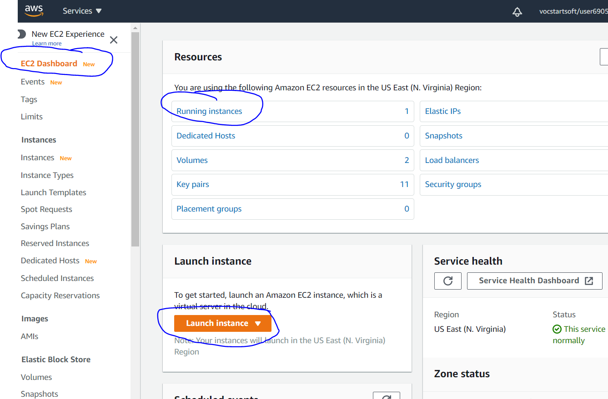
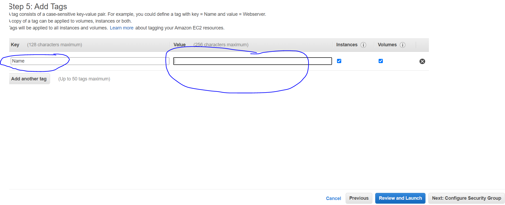
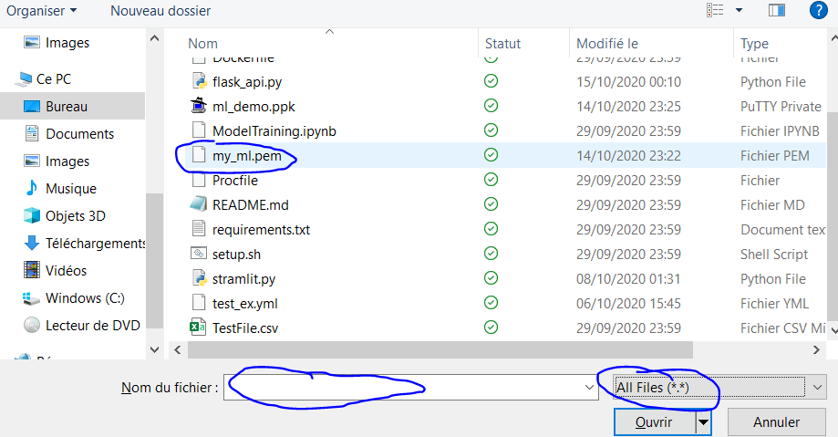
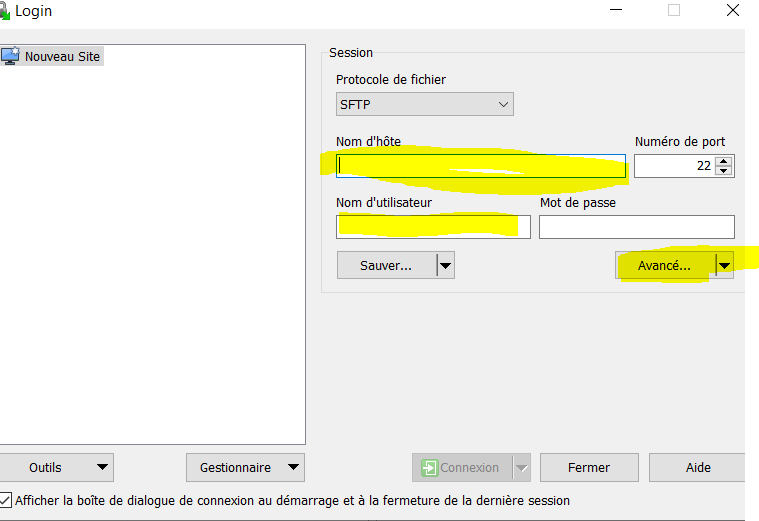
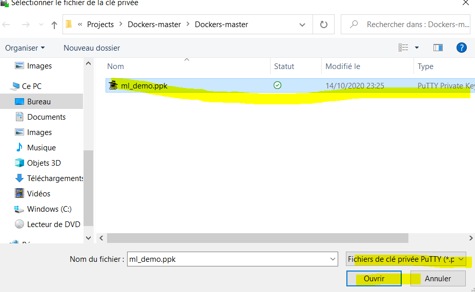
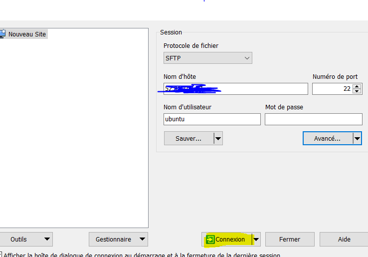
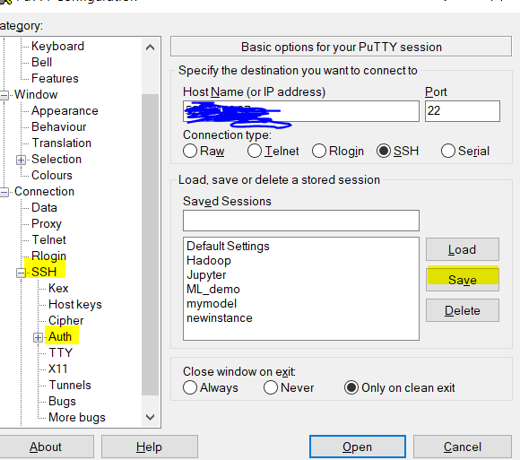

Deployment in AWS EC2

Once finish our model creation, need to create API with help of Flask

Create an account in AWS

Then launch EC2 instance

Click to select services then type EC2

Click on launch instance

Choose ubuntu server

Make sure to select free tier

Create VPC and subnet

Enable auto-assign Public IP

Select storage depends on needs

Make sure to create new security group

Add All traffic it allows access to everyone and choose Anywhere

Shou

Should download Key pair once create new key pair

Then launch EC2 instance and connect

You can able to see your IP address, it helps to connect ubuntu server

Download putty and puttygen if you don’t have them in your machine

Open puttygen go to key pair located folder and load the file to see
file select all

Create file name

Save as private key

Open Win SCP and select your IP address and name as ubuntu, then click
on advanced settings

Click SSH then Authentication browse file

Load the key pair file

Open your model location folder, click and drag into /home/ubuntu/
folder

Open putty load the file to connect ubuntu server

Once you enter into ubuntu server nee to be download all required files
because we’re using free tier so we need to install supporting libraries

After excute following code to run

1)  sudo apt-get update && sudo apt-get install python3-pip

2)  pip3 install -r requirements.txt

3)  python3 app.py

then go to your EC2 copy your IP address and paste on web now you can
able to run your model
